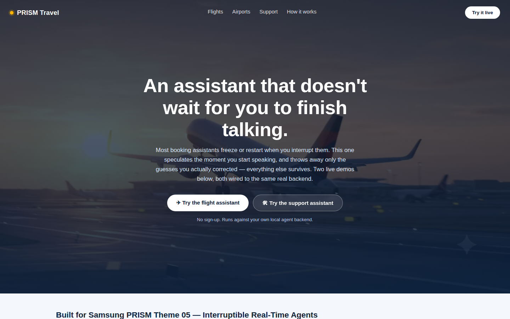
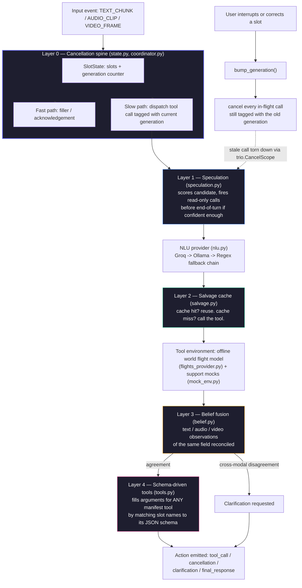
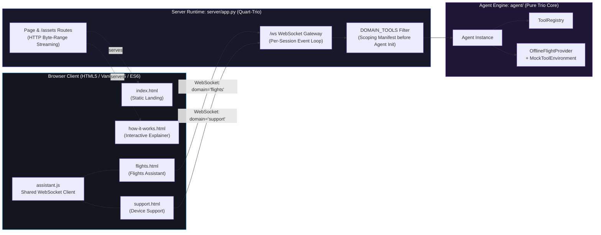
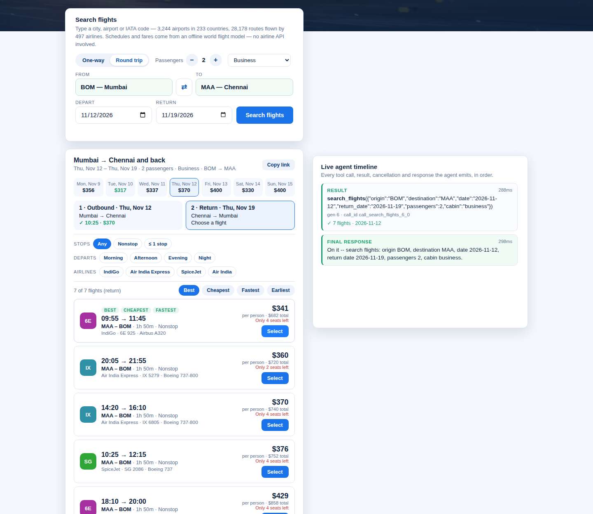
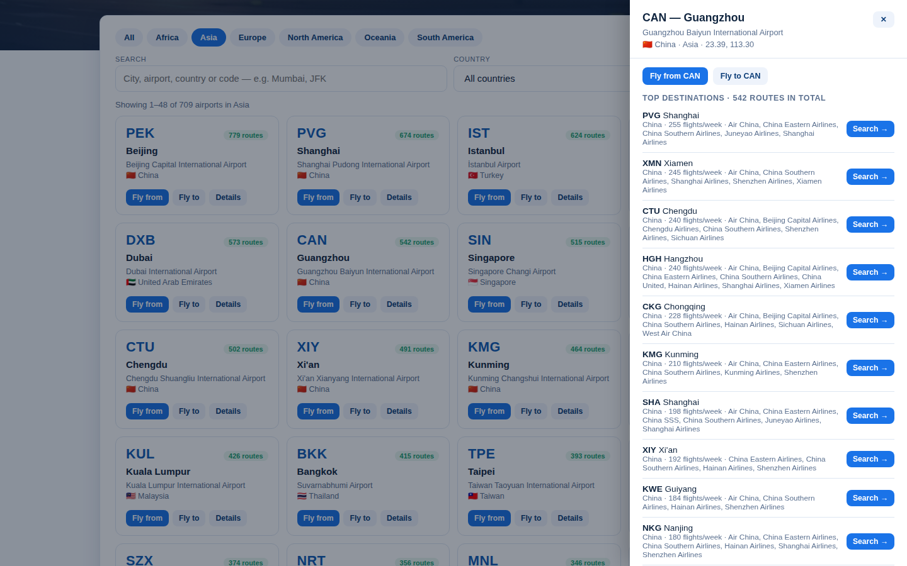
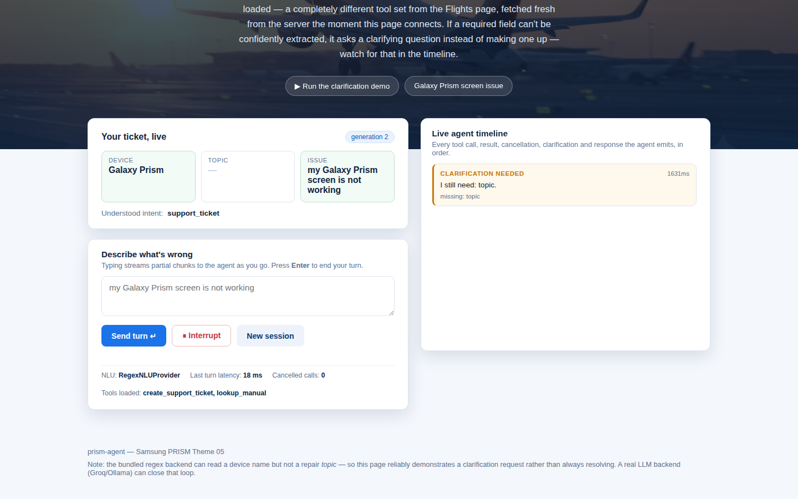
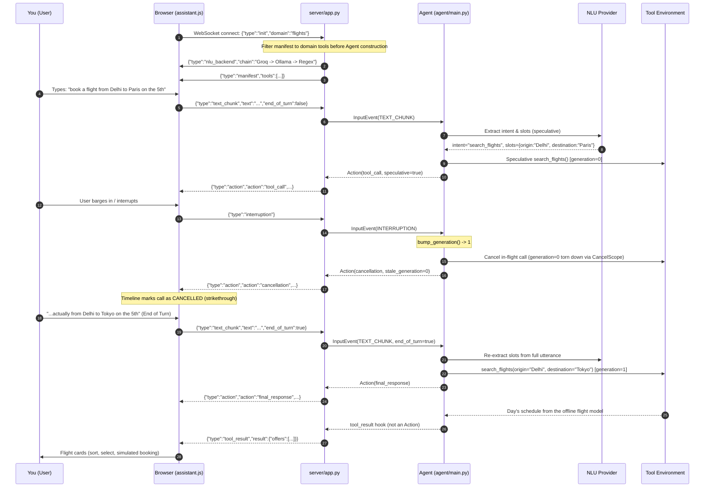

<div align="center">

# 🔮 prism-agent

### **An interruptible, full-duplex real-time agent with speculative dual-process execution**
*Built for the Samsung PRISM Theme 05 Hackathon*

---

[](https://www.python.org/)
[](https://trio.readthedocs.io/)
[](tests/)
[](#-world-flight-model-no-airline-api)
[](#-nlu-backend-configuration)
[](#-running-the-full-app-frontend--backend)
[](LICENSE)

<br/>

[🌟 Overview](#-what-this-project-is) • [🏗️ Architecture](#%EF%B8%8F-architecture) • [🚀 Quick Start](#-setup--quick-start) • [🖥️ Web App](#-running-the-full-app-frontend--backend) • [⚡ E2E Flow](#-how-a-request-actually-flows-end-to-end) • [🤖 NLU Configuration](#-nlu-backend-configuration) • [🧪 Test Suite](#-testing)

<br/>



</div>

---

## 📑 Table of Contents

- [🔮 What this project is](#-what-this-project-is)
- [🏗️ Architecture](#%EF%B8%8F-architecture)
  - [Request lifecycle inside the agent](#request-lifecycle-inside-the-agent)
  - [Layer-by-layer breakdown](#layer-by-layer-breakdown)
  - [Frontend ↔ Backend component map](#frontend--backend-component-map)
- [📂 Repository layout](#-repository-layout)
- [⚙️ Setup & Quick Start](#%EF%B8%8F-setup--quick-start)
- [💻 Running the backend only (CLI)](#-running-the-backend-only-cli)
- [🌐 Running the full app: frontend + backend](#-running-the-full-app-frontend--backend)
- [🎬 The four pages, and what each proves](#-the-four-pages-and-what-each-proves)
- [🔄 How a request actually flows, end to end](#-how-a-request-actually-flows-end-to-end)
- [🛡️ Reliability notes (frontend)](#%EF%B8%8F-reliability-notes-frontend)
- [🚀 Deployment](#-deployment)
- [🤖 NLU backend configuration](#-nlu-backend-configuration)
- [🛫 World flight model (no airline API)](#-world-flight-model-no-airline-api)
- [🧪 Testing](#-testing)
- [🔍 Known simplifications](#-known-simplifications)
- [📄 License](#-license)

---

## 🔮 What this project is

Most conversational agents treat an interruption as **reactive cleanup**: the user speaks, the agent initiates a tool call, and if the user interrupts mid-call, special-case code attempts to cancel or patch things up.

`prism-agent` flips this premise:

> [!IMPORTANT]
> **Speculating before the user finishes talking, and cancelling the speculation if it turns out wrong, is the default behavior on almost every turn** — not an edge case.

Everything hangs off a single core data structure: **`SlotState`** — a per-session store of extracted slots paired with a monotonically increasing `generation` counter.

```
       User Speech (Streaming Chunks)
                     │
         predict intent & slots early
                     ▼
  ┌─────────────────────────────────────┐
  │  Speculative Tool Call Dispatched   │  (generation = N, tagged in Trio CancelScope)
  └──────────────────┬──────────────────┘
                     │
        User barged in / corrected?
        ┌────────────┴────────────┐
       YES                        NO
        │                          │
        ▼                          ▼
  bump_generation()        Turn completes cleanly
        │                          │
        ▼                          ▼
 CancelScope.cancel()       Result delivered instantly!
 (Zero stale leakage)       (Massive latency win)
```

1. Every tool call is tagged with the `generation` current at dispatch time.
2. When the user interrupts or corrects themselves, `bump_generation()` is invoked.
3. Every in-flight call still tagged with the stale generation is cancelled instantly through its own `trio.CancelScope`.
4. **No polling, no manual tracking, zero call-site bookkeeping.**

The repository is structured into two complementary halves:

- **`agent/`** — **The Submission Core**: cancellation spine, speculative execution, salvage cache for cancelled-but-reusable results, multimodal belief fusion, and schema-driven tool execution for never-before-seen tools. Runs completely headless via `demo.py` or the test suite.
- **`server/` + `frontend/`** — **The Interactive Web Interface**: A native Quart-Trio ASGI server and WebSocket bridge delivering a reactive, zero-build browser UI that displays live cancellation timelines, trip states, and barge-in events in real time.

---

## 🏗️ Architecture

### Request lifecycle inside the agent



### Layer-by-layer breakdown

| Layer | Component Files | Core Responsibility | Evaluation Target |
|:---:|---|---|---|
| **0** | `state.py`<br>`coordinator.py`<br>`events.py` | Generation-tagged cancellation spine; idempotency keys ensuring retried mutating calls cannot double-book or produce side effects. | **Interruption Recovery (35%)**<br>**Safety (10%)** |
| **1** | `speculation.py` | Completeness-driven candidate scoring; speculatively dispatches read-only calls before turn completion. | **Response Latency (15%)**<br>**Interruption Recovery (35%)** |
| **2** | `salvage.py` | Caches results under a stable slot-key so cancelled-yet-valid computations are immediately reused rather than re-dispatched. | **Interruption Recovery (35%)**<br>**Task Completion (40%)** |
| **3** | `belief.py` | Fuses text, audio, and video beliefs over identical slots; isolates authentic cross-modal disagreements to trigger clarifications. | **Multimodal Disagreement**<br>**Task Completion (40%)** |
| **4** | `tools.py` | Schema-driven argument extraction matching slot values to manifest JSON schemas for novel, unseen tools. | **Unseen Tool Generalization**<br>**Task Completion (40%)** |
| **—** | `nlu.py` | Multi-tier intent & slot extraction: Groq (cloud) → Ollama (local) → Anthropic → Regex deterministic fallback. | **Natural Language Grounding** |
| **—** | `protocol.py` | Strict JSON-schema validation over every outbound `Action` payload prior to emission. | **Protocol Safety (10%)** |
| **—** | `flights_provider.py`<br>`airports.py`<br>`travel_parse.py` | Offline world flight model: every major airport, day-to-day schedules, fares, connections and simulated bookings; airport gazetteer + date parsing behind the NLU. No airline API. | **Task Completion (40%)**<br>**Natural Language Grounding** |
| **—** | `mock_env.py` | Deterministic tool backend mock with injectable latencies and fault controls. | **Reproducible Benchmarking** |
| **—** | `main.py` | `Agent` harness orchestrating channels, nurseries, and cross-layer state transitions. | **End-to-End Coordination** |

### Frontend ↔ Backend component map



> [!NOTE]
> **Strict Sandboxing**: The `FILTER` step executes **before** the session's `Agent` is instantiated. When a user connects to the `/flights` endpoint, the agent's tool registry physically does not contain `create_support_ticket` or `lookup_manual`. Every browser tab receives an isolated `Agent` and a fresh `SlotState`.

---

## 📂 Repository layout

```
prism-agent/
├── agent/                         # Core submission: 5 layers + NLU + Protocol
│   ├── main.py                    # Agent coordinator wiring channels and nurseries
│   ├── state.py                   # SlotState + atomic generation counter   (Layer 0)
│   ├── coordinator.py             # Fast/slow path dispatch & cancellation (Layer 0)
│   ├── speculation.py             # Speculative candidate scoring & dispatch (Layer 1)
│   ├── salvage.py                 # Stable slot-key partial-result cache     (Layer 2)
│   ├── belief.py                  # Multi-source belief fusion engine        (Layer 3)
│   ├── tools.py                   # Zero-shot schema-driven arg mapper       (Layer 4)
│   ├── nlu.py                     # 3-tier fallback chain (Groq/Ollama/Regex)
│   ├── asr.py                     # Local faster-whisper ASR integration
│   ├── protocol.py                # Schema validation for outbound actions
│   ├── mock_env.py                # Deterministic tool environment with latency
│   ├── airports.py                # World airport gazetteer: search, place resolution
│   ├── travel_parse.py            # Origin/destination/date extraction from free text
│   ├── flights_provider.py        # Offline day-to-day flight engine (search + booking)
│   ├── data/flight_model.json.gz  # Compiled world flight model (~400 KB)
│   ├── harness.py                 # Virtual-clock trace replay harness
│   └── events.py, trace.py        # Event primitives and JSON trace serialization
├── server/
│   ├── app.py                     # Native Quart-Trio ASGI server & WebSocket bridge
│   └── port_guard.py              # Stops a stale server still holding the port (Windows-safe)
├── frontend/
│   ├── index.html                 # Atmospheric hero landing page
│   ├── flights.html               # Flight search + booking, live agent (barge-in demo)
│   ├── airports.html              # Airport explorer: every airport by continent / country
│   ├── support.html               # Live device support agent (clarification demo)
│   ├── how-it-works.html          # Interactive architecture and layer guide
│   └── assets/
│       ├── style.css              # Custom dark-theme glassmorphism design system
│       ├── assistant.js           # Full-duplex WebSocket client & reactive timeline
│       ├── flights.js             # Search form, results, filters, round trips, booking
│       ├── airports.js            # Airport explorer grid, filters, details drawer
│       ├── hero.mp4               # High-definition video hero loop
│       └── hero-poster.jpg        # Fast-paint video poster fallback
├── manifests/
│   └── travel_manifest.json       # Tool schemas (search_flights, book_flight, etc.)
├── scripts/
│   └── build_flight_model.py      # Builds ("trains") the flight model from public data
├── tests/                         # 159 unit & integration tests across all layers
├── demo.py                        # Standalone terminal walkthrough scenario
├── .env.example                   # NLU backend template (copy to .env)
├── Procfile                       # `web: python server/app.py` — for PaaS deploys
├── pyproject.toml                 # Package configuration & optional dependency sets
└── LICENSE                        # MIT License
```

---

## ⚙️ Setup & Quick Start

Requires **Python 3.10, 3.11, or 3.12**.

### 1. Installation

```bash
# Core package + test dependencies
pip install -e ".[dev]"

# (Recommended) Install with web extras for the live browser UI
pip install -e ".[dev,web]"

# All optional components (Claude, Whisper local ASR, Web UI)
pip install -e ".[dev,web,llm,local]"
```

### 2. Environment Configuration

The project ships with an `.env.example` template:

<details open>
<summary><b>PowerShell (Windows)</b></summary>

```powershell
Copy-Item .env.example .env
notepad .env   # Insert your GROQ_API_KEY (free from console.groq.com)

# Load into current PowerShell session:
Get-Content .env | Where-Object { $_ -notmatch '^\s*#' -and $_ -match '=' } |
  ForEach-Object { $k,$v = $_ -split '=',2; Set-Item "env:$($k.Trim())" $v.Trim() }
```
</details>

<details>
<summary><b>Bash / Zsh (Linux / macOS)</b></summary>

```bash
cp .env.example .env
nano .env      # Insert your GROQ_API_KEY

# Load into environment:
set -a && source .env && set +a
```
</details>

> [!TIP]
> If `.env` is omitted, `prism-agent` automatically operates in deterministic **Regex mode** — zero network requests, zero cost, completely offline.

---

## 💻 Running the backend only (CLI)

Stream an interruption and slot-correction scenario directly in the terminal without opening a browser:

```bash
python demo.py
```

### CLI Demo Execution Output

```text
=== Scenario: booking a flight, then barging in with a correction ===

> user: "book a flight from Delhi to Paris on the 5th"
  [     tool_call] {"call_id": "call_nlu_extract_0_0", "tool": "nlu_extract", "args": {...}, "generation": 0, "speculative": true}

> user interrupts: "actually..."
> user: "...from Delhi to Tokyo on the 5th"

  [  cancellation] {"call_id": "call_nlu_extract_0_0", "tool": "nlu_extract", "stale_generation": 0, "current_generation": 1}
  [        filler] {"text": "Go ahead, I'm listening.", "reason": "interruption_ack"}
  [     tool_call] {"call_id": "call_search_flights_4_1", "tool": "search_flights", "args": {"origin": "Delhi", "destination": "Tokyo", "date": "5th"}, "generation": 4, "speculative": false}
  [final_response] {"text": "On it -- search flights: origin Delhi, destination Tokyo, date 5th.", ...}

=== Final slot state ===
{
  "intent": "search_flights",
  "slots": { "origin": "Delhi", "destination": "Tokyo", "date": "5th" },
  "generation": 4
}

=== Score-relevant checks ===
Stale calls cancelled: 1
Duplicate state-changing calls suppressed: 0
Salvage cache stats: {'hits': 0, 'misses': 1, 'hit_rate': 0.0, 'entries': 1}
Full trace written to last_run_trace.json
```

---

## 🌐 Running the full app: frontend + backend

Launch the Quart-Trio ASGI server:

```bash
python server/app.py
```

```
prism-agent web bridge -> http://127.0.0.1:8000  (Ctrl+C to stop)
```

Point your browser to **`http://127.0.0.1:8000`**. The single process serves the HTML pages, streaming CSS/JS/video assets, and the high-throughput WebSocket bridge.

> [!IMPORTANT]
> **After pulling new code, restart the server** (`Ctrl+C`, then `python server/app.py` again). Pages are read
> from disk on every request but the API lives in the running process, so an old process serves new pages against
> old endpoints. The pages detect this through `GET /api/version` and show a red banner.
>
> **Old process still holding the port?** Hypercorn sets `SO_REUSEADDR`, and on Windows that lets a new server bind
> a port an *old* server is still listening on — the restart "works" but the old process keeps answering. On start-up
> `server/app.py` now checks the port: if an older prism-agent server (a Python process serving these pages) is
> there, it stops it and takes the port; if some other program owns it, it moves to the next free port and prints
> the URL. It then binds with `SO_EXCLUSIVEADDRUSE` on Windows so the port can't be shared again. Set
> `PRISM_REPLACE_OLD=0` to never stop another process. Manual fix on Windows:
> `netstat -ano | findstr :8000` → `taskkill /PID <pid> /F`.
>
> `server/app.py` also always imports the `agent` package next to it, so a stale copy from an earlier
> `pip install .` can't shadow your working tree.

---

## 🎬 The five pages, and what each proves

| Page | URL | Visible Manifest Tools | Technical Capability Demonstrated |
|---|---|---|---|
| **Landing** | `/` | *None (Static)* | Atmospheric overview, architecture summary, and quick navigation into live test pages. |
| **Flights** | `/flights` | `search_flights`<br>`book_flight` | **Full booking flow + Live Barge-In**: From/To autocomplete over every major airport (popular airports on focus, keyboard navigation, swap), one-way / round trip, 1–9 passengers, four cabins, a ±3-day fare strip, filters (stops, departure time, airline), sorting, per-leg selection and a simulated booking. The form drives the agent over the WebSocket (with an automatic REST fallback), and free-text turns fill the form back in. Barge in with a different destination and watch the stale speculative search strike through in the timeline. |
| **Airports** | `/airports` | *None (REST)* | **World airport explorer**: all 3,244 airports, filterable by continent, country and free text, sortable, paginated; a details drawer with each airport's busiest destinations, weekly frequencies and airlines, and one-click **Fly from / Fly to / Search** links into `/flights`. |
| **Support** | `/support` | `create_support_ticket`<br>`lookup_manual` | **Grounded Clarification**: Solicits device issue descriptions. When required slots are ambiguous, the agent formulates clarifying questions rather than hallucinating. |
| **How It Works** | `/how-it-works` | *None (Static)* | Comprehensive interactive breakdown of the 5 architectural layers and their rubric alignments. |

<div align="center">
  <table width="100%">
    <tr>
      <td width="50%" align="center">
        <b>Flight search, round trip + live agent timeline (<code>/flights</code>)</b><br/>
        
      </td>
      <td width="50%" align="center">
        <b>World airport explorer (<code>/airports</code>)</b><br/>
        
      </td>
    </tr>
    <tr>
      <td width="50%" align="center">
        <b>Device Support Clarification (<code>/support</code>)</b><br/>
        
      </td>
      <td width="50%" align="center">
        <b>Landing page (<code>/</code>)</b><br/>
        
      </td>
    </tr>
  </table>
</div>

> [!TIP]
> Both live pages include a **"▶ Run the demo"** chip that streams an automated script across the real WebSocket to observe real-time cancellation without manual typing.

---

## 🔄 How a request actually flows, end to end

The diagram below tracks the exact wire protocol frames exchanged between `assistant.js` and `server/app.py` during an interruption:



### Critical WebSocket Bridge Details
1. **Mandatory Handshake**: The `init` frame must be the first message transmitted. It ensures the session's `Agent` is bound strictly to the selected domain.
2. **State Synchronization**: A `{"type":"state", "intent", "slots", "generation"}` packet is dispatched after every action, updating the UI's reactive trip card without client polling.
3. **Tool results**: finished (never cancelled) tool calls are streamed as `tool_result` frames through the agent's `tool_result_listener` hook — the agent's own five-action protocol is unchanged. A result is ignored by the UI if a newer call to the same tool has since been dispatched.
4. **HTTP Byte-Range Audio/Video**: `server/app.py` implements RFC-compliant byte-range streaming for `hero.mp4`, enabling seeking and instant video playback.

---

## 🛡️ Reliability notes (frontend)

A few things `frontend/assets/assistant.js` does on purpose, worth knowing before you poke at the
live pages or build on top of them:

- **Self-healing WebSocket.** If the server restarts or the connection drops, the status pill walks
  `disconnected` → `reconnecting (n)…` and retries with exponential backoff (1s, 2s, 4s, capped at
  8s) until it's back — no page refresh required. Each socket carries its own identity, so a late
  `close` event from an already-superseded connection can't trigger a second, overlapping reconnect
  loop.
- **A send that can't go out says so.** Pressing Enter or clicking "Send turn" while the socket
  isn't open shows an inline hint instead of silently doing nothing, and the typed text stays in the
  box instead of being discarded.

  > [!NOTE]
  > An earlier version advanced its internal "already sent" counter even when the underlying
  > `ws.send()` had silently no-op'd — so text typed during a brief disconnect could be marked as
  > sent without ever reaching the server. That's what made the page occasionally look unresponsive
  > with zero error feedback. Fixed by only advancing that counter once a send actually succeeds, and
  > verified with a Playwright test that kills and restarts the server mid-session.

- **The demo chip can't double-fire.** It disables itself and swaps its label to "⏳ Running…" for
  the duration of the scripted walkthrough, so a second click can't kick off an overlapping run
  against the same session.
- **Input is capped client-side** (`MAX_INPUT_LENGTH` in `assistant.js`, 2000 characters) purely for
  UX feedback — the actual enforcement is server-side (see `PRISM_MAX_TEXT_LENGTH` below), since a
  client-side-only cap isn't trustworthy on its own.

---

## 🚀 Deployment

The defaults (`127.0.0.1:8000`, no auth, in-memory per-connection state) are right for local
development and live demos. `server/app.py` already reads the following environment variables, so
most of the way to an actual deployment is just setting them:

| Variable | Default | What it does |
|---|---|---|
| `PORT` / `PRISM_PORT` | `8000` | Port to bind. Most PaaS providers (Render, Railway, Fly, Heroku-style buildpacks) set `PORT` for you automatically. |
| `PRISM_HOST` | `0.0.0.0` if `PORT` is set, else `127.0.0.1` | Bind address. The default flips automatically so a plain `python server/app.py` on a laptop stays loopback-only, while a `PORT`-driven deploy binds every interface the way platforms expect. |
| `PRISM_MAX_TEXT_LENGTH` | `2000` | Hard cap, in characters, on one incoming `text_chunk`'s text — enforced server-side regardless of the frontend's own cap, so a client that skips the browser entirely can't send an unbounded payload. |
| `PRISM_LOG_LEVEL` | `INFO` | Python `logging` level. Every connection logs its own connect/domain/NLU-chain/disconnect, tagged with a short per-connection id. |
| `PRISM_FLIGHTS_BACKEND` | `model` | `model`: offline world flight model (no API keys). `mock`: the original fake generator in `mock_env.py`. See [World flight model](#-world-flight-model-no-airline-api) below. |

A generic deploy (exact UI varies by platform, the shape doesn't):

1. Push this repo to GitHub.
2. Create a web service from it. Build command: `pip install -e ".[web]"`. Start command (also
   provided as a `Procfile` for platforms that read one): `python server/app.py`.
3. Set `PRISM_NLU_BACKEND` and whatever key it needs in the platform's environment-variable UI —
   never commit real API keys. Leave `PORT`/`PRISM_HOST` alone; the platform sets `PORT` and the
   default host logic picks that up automatically.
4. `GET /healthz` returns `{"status": "ok"}` — point the platform's health check at it.

> [!IMPORTANT]
> **Honest scaling caveat:** each browser tab's `SlotState` and `Agent` live in that one server
> process's memory for the lifetime of its WebSocket connection — there's no shared store. One
> process handles many concurrent connections fine (that's exactly what trio's structured
> concurrency is for), but running more than one process/instance behind a load balancer needs
> either sticky sessions or moving `SlotState` out to a shared backend (Redis, etc.). That's real
> follow-up work for a multi-instance deploy, not something to assume away — for a single-instance
> deploy it doesn't matter at all.

---

## 🤖 NLU backend configuration

`prism-agent` features a pluggable NLU layer where cloud and local LLMs generalize across any tool manifest, with deterministic regex fallback.

| Backend (`PRISM_NLU_BACKEND`) | Cost / Tier | Prerequisites | Capabilities & Behavior |
|:---:|:---:|---|---|
| **`regex`** | Free | None (Default) | Deterministic keyword matching. Zero external calls, zero latency. |
| **`groq`** | Free Cloud | `GROQ_API_KEY` ([console.groq.com](https://console.groq.com)) | High-speed Llama 3 via stdlib `urllib` (no additional pip packages required). |
| **`ollama`** | Free Local | [Ollama](https://ollama.com) running + `llama3.2:3b` | Completely offline zero-egress inference on localhost. |
| **`groq+ollama`** ⭐ | **Free** | Both Groq key & Ollama running | **3-Tier Robust Chain**: Groq $\to$ Ollama $\to$ Regex. Maximum speed with graceful local degradation. |
| **`ollama+groq`** | Free | Both Groq key & Ollama running | **Local-First**: Tries offline Ollama first; calls Groq if local is unavailable. |
| **`anthropic`** | Paid Cloud | `ANTHROPIC_API_KEY` | Claude 3.5 Sonnet / Haiku. Auto-selected if key is detected. |

### Environment Variables Reference

| Variable | Default Value | Description |
|---|---|---|
| `PRISM_NLU_BACKEND` | `regex` | Selects active provider: `groq+ollama`, `groq`, `ollama`, `anthropic`, or `regex`. |
| `GROQ_API_KEY` | — | API key for Groq cloud inference. |
| `PRISM_GROQ_MODEL` | `llama-3.1-8b-instant` | Groq model selection. |
| `PRISM_OLLAMA_MODEL` | `llama3.2:3b` | Target Ollama model name. |
| `OLLAMA_HOST` | `http://localhost:11434` | Ollama service endpoint. |
| `ANTHROPIC_API_KEY` | — | API key for Anthropic Claude. |
| `PRISM_NLU_MODEL` | `claude-3-5-sonnet-latest`| Claude model override. |

---

## 🛫 World flight model (no airline API)

The `/flights` page — the From/To autocomplete, the conversational search and `search_flights` /
`book_flight` — runs on an **offline world flight model**. No airline API, no API key, no network
calls at runtime.

### How the model is built ("trained")

`scripts/build_flight_model.py` compiles two public datasets into `agent/data/flight_model.json.gz`
(~400 KB, committed, loaded once at server start):

| Source | License | What it contributes |
|---|---|---|
| [OurAirports](https://ourairports.com/data/) | Public domain | Every airport: type (large/medium), scheduled-service flag, IATA code, city, coordinates, alternate names (“Bombay”, “Madras”, “Peking”, “NYC”) |
| [OpenFlights](https://openflights.org/data.html) | ODbL 1.0 | ~67,000 airline routes (which airline flies which airport pair, with which aircraft), airline names, aircraft types, IANA time zones |

The build is data-driven end to end:

1. **Airports** — the 3,244 large + medium airports with scheduled service and an IATA code, each scored by
   how many airline-routes touch it. The score ranks autocomplete (“new york” → JFK, EWR, LGA before Islip)
   and decides what a bare city name means (“London” → LHR, LGW, STN, LTN).
2. **Carriers** — airlines.dat reuses codes (VY is Vueling *and* Formosa Airlines); each code is resolved to
   the airline whose home country matches where its routes actually fly. Codes whose routes never touch the
   named airline's country are flagged — the significant ones corrected, the rest shown as “Airline XX”.
3. **Cleaning** — codeshares and codeshare-like entries dropped; carriers that merged since 2014 folded into
   their successor (US Airways → American), ceased ones removed (Air Berlin, Jet Airways…); routes of replaced
   airports moved to the new airport (Tegel/Schönefeld → BER, Dakar → DSS…) and re-coded airports matched by ICAO.
4. **Frequency model** — every airline-route gets a weekly frequency from a gravity model (connectivity of both
   airports, damped by distance, capped per distance band), with one global scale fitted by bisection so the
   network flies **~106,000 departures a day** — the real-world total (~38.9M commercial flights in 2019).

```bash
python scripts/build_flight_model.py   # re-download sources (~15 MB, cached in build/) and rebuild
```

### What it gives you, day by day

`agent/flights_provider.py` turns the model into day-to-day data for any date up to ~11 months ahead:

- **which flights operate that day** (weekly frequencies spread across the week — a 3×-weekly long-haul only
  shows on its days), with flight numbers and departure times that stay stable like a real timetable;
- **block times** from great-circle distance with an eastbound/westbound wind adjustment, and **arrival times
  in the destination's local time zone** (DST-aware);
- **connections** through real hubs when direct service is thin — one-stop, two-stop as a last resort — with
  minimum connection times;
- **fares** from distance, advance purchase, weekday, season, time of day, competition on the route and
  low-cost carriers; **seats left**; and **simulated bookings** with a 6-character confirmation code
  (idempotent — the same offer and passenger never double-book);
- **trip options**: one-way or round trip (a separate return leg with its own offers), 1–9 passengers with
  per-person and total prices, and Economy / Premium Economy / Business / First cabins with their own fares and
  seat counts — understood from free text too (*“back on the 20th, 2 adults, business class”*);
- a **fare calendar** (lowest fare per day, ±3 days) and each airport's **top destinations**.

Everything is deterministic per (route, date): the same search returns the same flights and prices; a different
date changes them the way a real schedule would.

### Understanding free text about any airport

`agent/travel_parse.py` uses the same gazetteer, so the regex NLU (no LLM needed) understands any major airport,
city or historic name in natural phrasing — *“outta chicago headed to miami next friday”*, *“Mumbai → Frankfurt
12 december”*, *“flights from bombay to madras in 3 days”* — and dates like *tomorrow*, *next friday*,
*this weekend*, *dec 12*, *the 5th*, *in 3 days*. Unknown places are still captured, at lower confidence, and the
search explains what it couldn't match with suggestions.

### Honest limits

This is a **model of the network, not live availability**. Real-time delays, cancellations, sold-out flights and
today's actual fares cannot be known without a live feed. The route network is OpenFlights' **June 2014
snapshot**: the build updates it for known mergers, shutdowns and replaced airports, but it can't add routes
launched since. Every result carries `"modeled": true`, and the UI labels schedules and bookings as modeled /
simulated.

### API (used by the frontend)

| Endpoint | Returns |
|---|---|
| `GET /api/version` | API version + model counts (pages use it to detect a stale server) |
| `GET /api/airports?q=lon` | Ranked airport suggestions |
| `GET /api/airports/popular?n=12&continent=EU` | Best-connected airports (the From/To list before typing) |
| `GET /api/airports/browse?continent=&country=&q=&sort=routes\|name\|code&page=&page_size=&routes_only=1` | Paginated airport directory (the explorer) |
| `GET /api/countries?continent=AS` | Continents + countries with airport counts |
| `GET /api/airport/BOM?n=15` | One airport with its top destinations, weekly flights and airlines |
| `GET /api/resolve?q=bombay` | The airport(s) a place string means |
| `GET /api/search?from=&to=&date=&return=&pax=&cabin=` | Direct search, no agent (shared links + the WebSocket fallback) |
| `GET /api/fares?from=&to=&date=&pax=&cabin=` | Lowest fare for each day around a date (the date strip) |
| `POST /api/book` `{"offer_id", "passenger_name"}` | Simulated booking of an offer from a recent search |
| `GET /api/routes/popular?n=4` | Random busy routes between major hubs (the hero chips) |
| `GET /api/model` | Model metadata: counts, sources, licences, calibration |
| WS `{"type":"book", "offer_id", "passenger_name"}` | Simulated booking of an offer from this session's search |
| WS `{"type":"tool_result", ...}` (server → browser) | Finished tool calls (flight offers), so results render live |

---

## 🧪 Testing

The repository maintains **100% passing test coverage** across all five architectural layers and backend providers:

```
tests/
├── test_layer0_cancellation.py      # Generation-tagged cancellation spine & idempotency
├── test_layer1_speculation.py       # Speculative dispatch thresholds & read-only enforcement
├── test_layer2_salvage.py           # Partial-result cache hits, misses & salvage logic
├── test_layer3_belief.py            # Multimodal cross-modality disagreement & fusion
├── test_layer4_unseen_tools.py      # Schema-driven argument extraction for novel tools
├── test_end_to_end_interruption.py  # Full agent pipeline under mid-call barge-in
├── test_nlu.py                      # Deterministic regex provider & FallbackNLUProvider
├── test_nlu_groq_plumbing.py        # Groq REST API integration (mocked HTTP)
├── test_nlu_ollama_plumbing.py      # Ollama local endpoint integration (mocked HTTP)
├── test_nlu_anthropic_plumbing.py   # Anthropic Claude worker offloading (mocked)
├── test_asr.py                      # Local Whisper ASR transcription contract
├── test_airports.py                 # World airport gazetteer: ranking, resolution, model counts
├── test_travel_parse.py             # Origin/destination/date extraction + date resolution
├── test_flights_provider.py         # Offline schedule engine: times, fares, connections, booking
├── test_trip_options.py             # Passengers / cabin / return dates, round trips, fare calendar
├── test_server_api.py               # Every HTTP endpoint + a full WebSocket search -> booking
├── test_port_guard.py               # Stale-server takeover, port fallback, Windows netstat parsing
└── test_tool_results.py             # Finished calls reach the host; cancelled calls never do
```

Execute the test suite:

```bash
python -m pytest tests/ -v
```

The suite is hermetic: `tests/conftest.py` clears `PRISM_NLU_BACKEND`, the API-key variables and the other
backend switches before every test, so running it from a shell that has loaded `.env` never makes real
Groq / Ollama / Anthropic calls (which would be slow, non-deterministic and race the tests' virtual clock).
Tests for a specific backend set the variables they need themselves.

```text
============================= 159 passed in 5.5s ==============================
```

---

## 🔍 Known simplifications

To ensure stability and transparent evaluation, certain production elements are stubbed or simplified:

| Domain | Current Implementation | Production Evolution Path |
|---|---|---|
| **Vision Grounding** | `VIDEO_FRAME` events assume `grounded_field` and `grounded_value` are already computed. Layer 3 belief fusion is fully implemented and tested. | Integrate real-time VLM frame captioning (e.g. PaliGemma / Moondream). |
| **Real ASR Stream** | `LocalWhisperASR` is implemented and verified against the contract; integration tests use pre-transcribed payloads. | Stream chunked PCM audio via WebSocket directly into `faster-whisper`. |
| **Environment Sandbox**| `create_support_ticket`/`lookup_manual` run on `mock_env.py`'s deterministic delays/fault injection. `search_flights`/`book_flight` run on the [offline world flight model](#-world-flight-model-no-airline-api): real airports and route network, modeled day-to-day schedules/fares, simulated bookings. | Feed the model a current schedule dataset (e.g. a licensed OAG/Cirium extract) through the same build script, if live accuracy is ever needed. |
| **Confidence Heuristic**| `score_candidate` uses a deterministic slot-completeness metric. | Replace with a calibrated probabilistic intent/slot confidence model. |

---

## 📄 License

Distributed under the **MIT License**. See [`LICENSE`](LICENSE) for complete terms.

<div align="center">
<sub>Built with 💜 for the Samsung PRISM GenAI Hackathon</sub>
</div>
