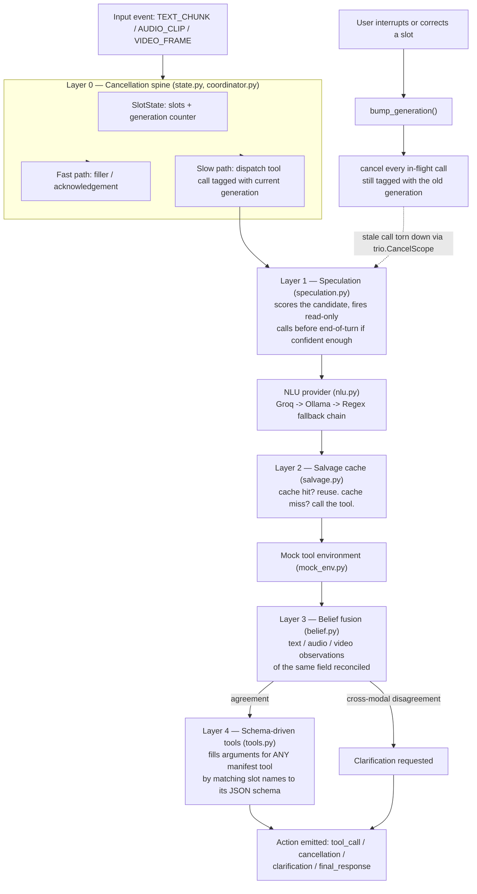
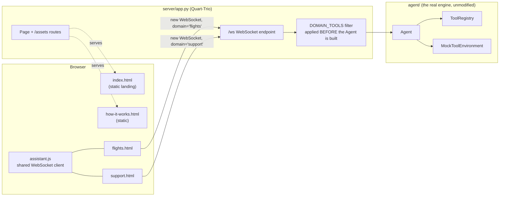
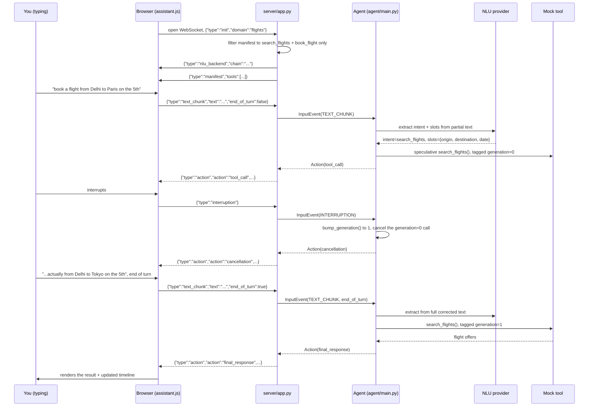

# prism-agent

**An interruptible, full-duplex real-time agent — Samsung PRISM Theme 05.**

   

## Table of Contents

1. [What this project is](#what-this-project-is)
2. [Architecture](#architecture)
3. [Repository layout](#repository-layout)
4. [Setup](#setup)
5. [Running the backend only (CLI)](#running-the-backend-only-cli)
6. [Running the full app: frontend + backend](#running-the-full-app-frontend--backend)
7. [How a request actually flows, end to end](#how-a-request-actually-flows-end-to-end)
8. [The four pages, and what each proves](#the-four-pages-and-what-each-proves)
9. [NLU backend configuration](#nlu-backend-configuration)
10. [Testing](#testing)
11. [Known simplifications](#known-simplifications)
12. [License](#license)

---

## What this project is

Most conversational agents treat an interruption as cleanup: the user talks, the agent calls a tool,
and if the user interrupts mid-call, some special-case code tries to patch things up. This project
inverts that. **Speculating before the user finishes talking, and cancelling the speculation if it
turns out wrong, is the default behavior on almost every turn** — not an edge case.

Everything hangs off one data structure: `SlotState`, a per-session store of extracted slots plus a
`generation` counter. Every tool call is tagged with the generation that was current when it was
dispatched. When the user interrupts or corrects themselves, the generation is bumped, and every
in-flight call still tagged with the old generation is cancelled through its own `trio.CancelScope`.
That's the whole cancellation mechanism — no polling, no per-call bookkeeping.

The repo has two halves:

- **`agent/`** — the actual submission: the cancellation spine, speculative execution, a salvage
  cache for cancelled-but-still-useful results, multimodal belief fusion, and schema-driven tool
  use for tools the agent has never seen before. Runs headless via `demo.py` or the test suite.
- **`server/` + `frontend/`** — a small web app that puts a real browser UI in front of that same
  agent, over a WebSocket, so the behavior above can actually be watched happening instead of read
  about in a trace file.

---

## Architecture

### Request lifecycle inside the agent



| Layer | File | What it actually does |
|---|---|---|
| 0 | `state.py`, `coordinator.py`, `events.py` | Generation-tagged cancellation; idempotency keys so a retried mutating call can't double-book |
| 1 | `speculation.py` | Scores a partial candidate and speculatively dispatches read-only tool calls before the turn ends |
| 2 | `salvage.py` | Caches results by a stable slot-key so a cancelled-but-correct call isn't wastefully re-run |
| 3 | `belief.py` | Fuses text/audio/video beliefs about the same slot; only genuine cross-modal disagreement triggers a clarification |
| 4 | `tools.py` | Extracts arguments for tools the agent has never hardcoded, purely from the manifest's JSON schema |
| — | `nlu.py` | Intent + slot extraction: Groq → Ollama → Anthropic → regex, auto-falling back on any failure |
| — | `protocol.py` | Validates every emitted `Action` payload against its schema before it leaves the agent |
| — | `mock_env.py` | Deterministic mock tool backends with injectable latency, so timing-dependent behavior is testable |
| — | `main.py` | `Agent` — wires all of the above into one runnable object |

### Frontend ↔ backend component map



The important detail: `FILTER` runs **before** the `Agent` object for that browser tab is even
constructed. A Flights tab's agent is handed a manifest that physically does not contain
`create_support_ticket` or `lookup_manual` — it isn't that the frontend hides those tools, the
backend never gave that session's agent the capability to use them. Every browser tab also gets its
own fresh `Agent` and its own fresh `SlotState`, so two tabs never see each other's slots.

---

## Repository layout

```
prism-agent/
├── agent/                   # the submission — all five layers + NLU + protocol
│   ├── main.py               Agent — wires every layer together
│   ├── state.py               SlotState + generation counter        (Layer 0)
│   ├── coordinator.py         fast/slow path dispatch + cancellation  (Layer 0)
│   ├── speculation.py         speculative dispatch engine             (Layer 1)
│   ├── salvage.py             partial-result cache                   (Layer 2)
│   ├── belief.py              multimodal belief fusion                (Layer 3)
│   ├── tools.py               schema-driven tool registry             (Layer 4)
│   ├── nlu.py                 Groq / Ollama / Anthropic / regex providers
│   ├── asr.py                 optional local Whisper speech-to-text
│   ├── protocol.py            validates every Action payload
│   ├── mock_env.py            mock tool backends (flights, support)
│   ├── harness.py             virtual-clock scenario replay
│   └── events.py, trace.py
├── tests/                    # 47 tests, one file per layer + NLU plumbing
├── manifests/
│   └── travel_manifest.json  tool schemas: search_flights, book_flight,
│                              create_support_ticket, lookup_manual
├── demo.py                   runnable CLI interruption scenario
├── server/
│   └── app.py                Quart-Trio WebSocket bridge + page/asset routes
├── frontend/
│   ├── index.html             landing page (no WebSocket)
│   ├── flights.html           live agent — search_flights / book_flight only
│   ├── support.html           live agent — create_support_ticket / lookup_manual only
│   ├── how-it-works.html      static architecture explainer
│   └── assets/
│       ├── style.css          shared design system
│       ├── assistant.js       shared WebSocket client + UI rendering
│       ├── hero.mp4           background video
│       └── hero-poster.jpg    poster frame shown before the video decodes
├── .env.example               NLU backend config template — copy to .env
├── pyproject.toml
└── LICENSE
```

---

## Setup

Requires Python 3.10, 3.11, or 3.12.

```bash
# 1. clone / open the project, then install the base package + dev deps
pip install -e ".[dev]"

# 2. (optional) add whichever extras you actually need:
pip install -e ".[dev,web]"        # the browser frontend (Quart-Trio)
pip install -e ".[dev,llm]"        # Anthropic Claude as an NLU backend
pip install -e ".[dev,local]"      # local Whisper speech-to-text
pip install -e ".[dev,web,llm,local]"   # everything
```

Then set up your `.env` — it's gitignored on purpose (it holds API keys), so it's never committed;
copy the template and edit it:

```powershell
# PowerShell
Copy-Item .env.example .env
notepad .env
```

```bash
# bash / zsh
cp .env.example .env
$EDITOR .env
```

`.env` only matters if you want an LLM-backed NLU provider (see
[NLU backend configuration](#nlu-backend-configuration)). With no `.env` at all, the agent still
runs — it just falls back to the free, dependency-free regex provider.

If you *are* using `.env`, load it into your shell before running anything:

```powershell
# PowerShell
Get-Content .env | Where-Object { $_ -notmatch '^\s*#' -and $_ -match '=' } |
  ForEach-Object { $k,$v = $_ -split '=',2; Set-Item "env:$($k.Trim())" $v.Trim() }
```

```bash
# bash / zsh
set -a && source .env && set +a
```

---

## Running the backend only (CLI)

No browser, no server — just the agent reading a scripted scenario and printing its trace:

```bash
python demo.py
```

This streams a realistic "book a flight, then interrupt and correct it" scenario through the agent
and prints exactly what layer 0 does: a speculative call dispatched, cancelled on interruption, and
a clarification asked for the fields that are still missing. The full structured trace is also
written to `last_run_trace.json`.

Run the test suite the same way:

```bash
python -m pytest tests/ -v
```

---

## Running the full app: frontend + backend

```bash
pip install -e ".[dev,web]"    # if you haven't already
python server/app.py
```

You'll see:

```
prism-agent web bridge -> http://127.0.0.1:8000  (Ctrl+C to stop)
```

Open that URL in a browser. That's it — `server/app.py` serves the HTML pages, the CSS/JS/video
assets, and the WebSocket endpoint all from one process; there's nothing else to start.

From there:

- `/` — the landing page, links into the two live demos below.
- `/flights` — type a request (e.g. *"book a flight from Delhi to Paris on the 5th"*), then
  interrupt it mid-search and correct the destination. Watch the timeline show the first search
  getting cancelled the instant the correction lands.
- `/support` — describe a device problem. The bundled regex NLU backend can pull out a device name
  but not a repair *topic*, so this reliably demonstrates the agent asking a clarifying question
  instead of guessing. Swap in Groq/Ollama (below) to see it resolve in one turn instead.
- `/how-it-works` — a static page explaining the five layers, for anyone who lands on the site
  without reading this README first.

Each live page also has a "▶ Run the demo" chip that replays a scripted scenario through the real
WebSocket connection — a one-click way to see the behavior without typing anything.

---

## How a request actually flows, end to end

This is what happens, in order, the moment you type into the Flights page and then interrupt
yourself — tracing the exact frames `server/app.py` and `assistant.js` send each other:



A few details that matter if you're reading `server/app.py` alongside this:

- The `init` frame **must** be the first thing sent on the socket — it's what decides which tools
  this session's `Agent` is even built with. `assistant.js` sends it automatically on connect.
- `{"type":"state", "intent", "slots", "generation"}` is sent after every single action, which is
  how the "Your trip, live" card on the page stays in sync without polling.
- `/assets/<path:filename>` serves `style.css` and `assistant.js` as well as `hero.mp4` — all as
  raw bytes, with HTTP Range support, so the background video can actually stream and seek in the
  browser instead of only working for text assets.

---

## The four pages, and what each proves

| Page | Route | Tools its `Agent` can see | What it's actually demonstrating |
|---|---|---|---|
| Landing | `/` | none (static) | Entry point, no backend claims made that aren't shown live elsewhere |
| Flights | `/flights` | `search_flights`, `book_flight` | Barge-in: a speculative call struck through live the instant a correction cancels it |
| Support | `/support` | `create_support_ticket`, `lookup_manual` | Clarification: the agent asks instead of guessing when a required field can't be grounded |
| How it works | `/how-it-works` | none (static) | The architecture above, written for a reader instead of a diagram |

---

## NLU backend configuration

The default `RegexNLUProvider` needs no setup and no network access, but only recognizes two
hardcoded intents via keyword matching. Set `PRISM_NLU_BACKEND` in `.env` to upgrade:

| Value | Cost | What you need | Behavior |
|---|:---:|---|---|
| `regex` *(default)* | free | nothing | Keyword matching, 2 hardcoded intents |
| `groq` | free | `GROQ_API_KEY` from [console.groq.com](https://console.groq.com), no card required | Understands any manifest tool via Llama 3 on Groq's API |
| `ollama` | free, local | [Ollama](https://ollama.com) installed + `ollama pull llama3.2:3b` | Same, fully offline |
| `groq+ollama` | free | both of the above | 3-tier chain: Groq → Ollama → regex. Recommended. |
| `ollama+groq` | free | both of the above | Same chain, local-first |
| `anthropic` | paid | `ANTHROPIC_API_KEY` | Most reliable; used automatically if the key is set |

All LLM backends read tool names, descriptions and schemas straight from the loaded manifest, so
they generalize to any tool — not just the two built in here — and every one of them degrades to
regex automatically if the call fails, via `FallbackNLUProvider`.

Other relevant variables: `PRISM_GROQ_MODEL` (default `llama-3.1-8b-instant`),
`PRISM_OLLAMA_MODEL` (default `llama3.2:3b`), `OLLAMA_HOST` (default `http://localhost:11434`),
`PRISM_NLU_MODEL` (default `claude-3-5-sonnet-latest`).

Starting Ollama on Windows, if your models need to live on a drive other than `C:`:

```powershell
$env:OLLAMA_MODELS = "D:\ollama-models"
Start-Process "$env:LOCALAPPDATA\Programs\Ollama\ollama.exe" -ArgumentList "serve"
& "$env:LOCALAPPDATA\Programs\Ollama\ollama.exe" pull llama3.2:3b
```

---

## Testing

```
tests/
├── test_layer0_cancellation.py      generation-tagged cancellation spine
├── test_layer1_speculation.py       speculative dispatch + confidence threshold
├── test_layer2_salvage.py           partial-result cache reuse
├── test_layer3_belief.py            cross-modality disagreement -> clarification
├── test_layer4_unseen_tools.py      schema-driven arg extraction for novel tools
├── test_end_to_end_interruption.py  the full agent, interrupted mid-call
├── test_nlu.py                      regex provider + fallback chain
├── test_nlu_groq_plumbing.py        Groq provider (mocked HTTP)
├── test_nlu_ollama_plumbing.py      Ollama provider (mocked HTTP)
├── test_nlu_anthropic_plumbing.py   Anthropic provider (mocked)
└── test_asr.py                      local Whisper ASR contract (mocked)
```

```
python -m pytest tests/ -v
# 47 passed
```

---

## Known simplifications

| Limitation | Current state |
|---|---|
| Vision / frame grounding | `VIDEO_FRAME` events assume `grounded_field`/`grounded_value` are already extracted — the fusion logic in `belief.py` is real and tested, only the upstream captioning step is stubbed |
| Real WAV transcription | `LocalWhisperASR` is implemented and wired, but not yet validated against a real audio file end to end |
| Tool environment | Tested against a self-authored mock (`mock_env.py`) matching the real eval kit's shape, not the real kit itself |
| Confidence scoring | `score_candidate` in `speculation.py` is a simple completeness/progress heuristic, not a learned model |

## License

MIT — see [LICENSE](LICENSE).
