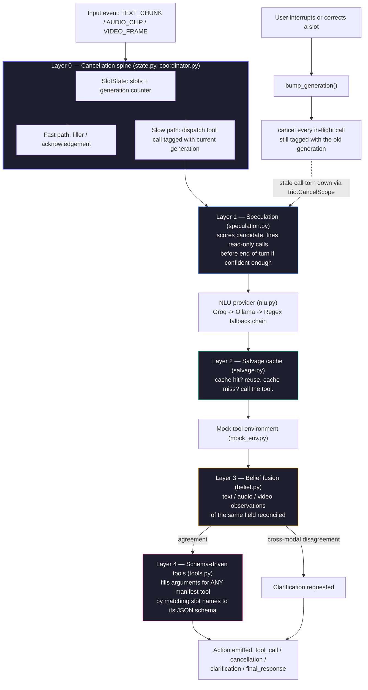
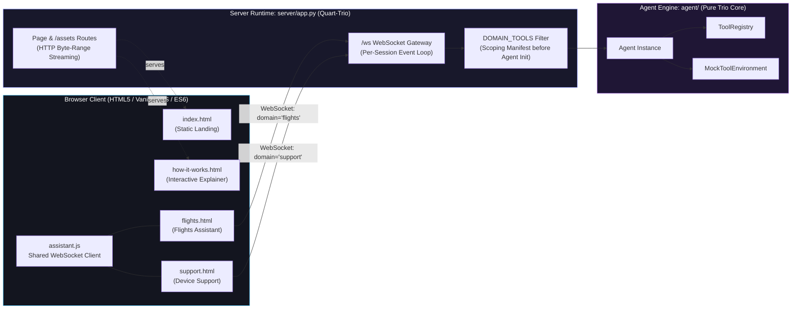
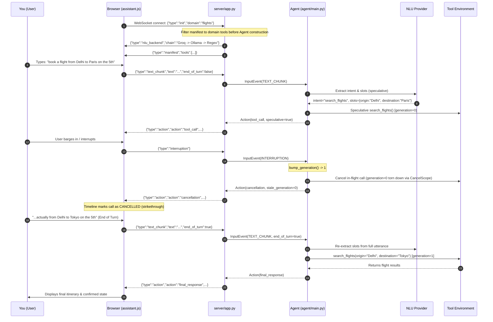

<div align="center">

# 🔮 prism-agent

### **An interruptible, full-duplex real-time agent with speculative dual-process execution**
*Built for the Samsung PRISM Theme 05 Hackathon*

---

[](https://www.python.org/)
[](https://trio.readthedocs.io/)
[](tests/)
[](#-nlu-backend-configuration)
[](#-running-the-full-app-frontend--backend)
[](LICENSE)

<br/>

[🌟 Overview](#-what-this-project-is) • [🏗️ Architecture](#%EF%B8%8F-architecture) • [🚀 Quick Start](#-setup--quick-start) • [🖥️ Web App](#-running-the-full-app-frontend--backend) • [⚡ E2E Flow](#-how-a-request-actually-flows-end-to-end) • [🤖 NLU Configuration](#-nlu-backend-configuration) • [🧪 Test Suite](#-testing)

<br/>


</div>

---

## 📑 Table of Contents

- [🔮 What this project is](#-what-this-project-is)
- [🏗️ Architecture](#%EF%B8%8F-architecture)
  - [Request lifecycle inside the agent](#request-lifecycle-inside-the-agent)
  - [Layer-by-layer breakdown](#layer-by-layer-breakdown)
  - [Frontend ↔ Backend component map](#frontend--backend-component-map)
- [📂 Repository layout](#-repository-layout)
- [⚙️ Setup & Quick Start](#%EF%B8%8F-setup--quick-start)
- [💻 Running the backend only (CLI)](#-running-the-backend-only-cli)
- [🌐 Running the full app: frontend + backend](#-running-the-full-app-frontend--backend)
- [🎬 The four pages, and what each proves](#-the-four-pages-and-what-each-proves)
- [🔄 How a request actually flows, end to end](#-how-a-request-actually-flows-end-to-end)
- [🤖 NLU backend configuration](#-nlu-backend-configuration)
- [🧪 Testing](#-testing)
- [🔍 Known simplifications](#-known-simplifications)
- [📄 License](#-license)

---

## 🔮 What this project is

Most conversational agents treat an interruption as **reactive cleanup**: the user speaks, the agent initiates a tool call, and if the user interrupts mid-call, special-case code attempts to cancel or patch things up.

`prism-agent` flips this premise:

> [!IMPORTANT]
> **Speculating before the user finishes talking, and cancelling the speculation if it turns out wrong, is the default behavior on almost every turn** — not an edge case.

Everything hangs off a single core data structure: **`SlotState`** — a per-session store of extracted slots paired with a monotonically increasing `generation` counter.

```
       User Speech (Streaming Chunks)
                     │
         predict intent & slots early
                     ▼
  ┌─────────────────────────────────────┐
  │  Speculative Tool Call Dispatched   │  (generation = N, tagged in Trio CancelScope)
  └──────────────────┬──────────────────┘
                     │
        User barged in / corrected?
        ┌────────────┴────────────┐
       YES                        NO
        │                          │
        ▼                          ▼
  bump_generation()        Turn completes cleanly
        │                          │
        ▼                          ▼
 CancelScope.cancel()       Result delivered instantly!
 (Zero stale leakage)       (Massive latency win)
```

1. Every tool call is tagged with the `generation` current at dispatch time.
2. When the user interrupts or corrects themselves, `bump_generation()` is invoked.
3. Every in-flight call still tagged with the stale generation is cancelled instantly through its own `trio.CancelScope`.
4. **No polling, no manual tracking, zero call-site bookkeeping.**

The repository is structured into two complementary halves:

- **`agent/`** — **The Submission Core**: cancellation spine, speculative execution, salvage cache for cancelled-but-reusable results, multimodal belief fusion, and schema-driven tool execution for never-before-seen tools. Runs completely headless via `demo.py` or the test suite.
- **`server/` + `frontend/`** — **The Interactive Web Interface**: A native Quart-Trio ASGI server and WebSocket bridge delivering a reactive, zero-build browser UI that displays live cancellation timelines, trip states, and barge-in events in real time.

---

## 🏗️ Architecture

### Request lifecycle inside the agent



### Layer-by-layer breakdown

| Layer | Component Files | Core Responsibility | Evaluation Target |
|:---:|---|---|---|
| **0** | `state.py`<br>`coordinator.py`<br>`events.py` | Generation-tagged cancellation spine; idempotency keys ensuring retried mutating calls cannot double-book or produce side effects. | **Interruption Recovery (35%)**<br>**Safety (10%)** |
| **1** | `speculation.py` | Completeness-driven candidate scoring; speculatively dispatches read-only calls before turn completion. | **Response Latency (15%)**<br>**Interruption Recovery (35%)** |
| **2** | `salvage.py` | Caches results under a stable slot-key so cancelled-yet-valid computations are immediately reused rather than re-dispatched. | **Interruption Recovery (35%)**<br>**Task Completion (40%)** |
| **3** | `belief.py` | Fuses text, audio, and video beliefs over identical slots; isolates authentic cross-modal disagreements to trigger clarifications. | **Multimodal Disagreement**<br>**Task Completion (40%)** |
| **4** | `tools.py` | Schema-driven argument extraction matching slot values to manifest JSON schemas for novel, unseen tools. | **Unseen Tool Generalization**<br>**Task Completion (40%)** |
| **—** | `nlu.py` | Multi-tier intent & slot extraction: Groq (cloud) → Ollama (local) → Anthropic → Regex deterministic fallback. | **Natural Language Grounding** |
| **—** | `protocol.py` | Strict JSON-schema validation over every outbound `Action` payload prior to emission. | **Protocol Safety (10%)** |
| **—** | `mock_env.py` | Deterministic tool backend mock with injectable latencies and fault controls. | **Reproducible Benchmarking** |
| **—** | `main.py` | `Agent` harness orchestrating channels, nurseries, and cross-layer state transitions. | **End-to-End Coordination** |

### Frontend ↔ Backend component map



> [!NOTE]
> **Strict Sandboxing**: The `FILTER` step executes **before** the session's `Agent` is instantiated. When a user connects to the `/flights` endpoint, the agent's tool registry physically does not contain `create_support_ticket` or `lookup_manual`. Every browser tab receives an isolated `Agent` and a fresh `SlotState`.

---

## 📂 Repository layout

```
prism-agent/
├── agent/                         # Core submission: 5 layers + NLU + Protocol
│   ├── main.py                    # Agent coordinator wiring channels and nurseries
│   ├── state.py                   # SlotState + atomic generation counter   (Layer 0)
│   ├── coordinator.py             # Fast/slow path dispatch & cancellation (Layer 0)
│   ├── speculation.py             # Speculative candidate scoring & dispatch (Layer 1)
│   ├── salvage.py                 # Stable slot-key partial-result cache     (Layer 2)
│   ├── belief.py                  # Multi-source belief fusion engine        (Layer 3)
│   ├── tools.py                   # Zero-shot schema-driven arg mapper       (Layer 4)
│   ├── nlu.py                     # 3-tier fallback chain (Groq/Ollama/Regex)
│   ├── asr.py                     # Local faster-whisper ASR integration
│   ├── protocol.py                # Schema validation for outbound actions
│   ├── mock_env.py                # Deterministic tool environment with latency
│   ├── harness.py                 # Virtual-clock trace replay harness
│   └── events.py, trace.py        # Event primitives and JSON trace serialization
├── server/
│   └── app.py                     # Native Quart-Trio ASGI server & WebSocket bridge
├── frontend/
│   ├── index.html                 # Atmospheric hero landing page
│   ├── flights.html               # Live flight agent (barge-in cancellation demo)
│   ├── support.html               # Live device support agent (clarification demo)
│   ├── how-it-works.html          # Interactive architecture and layer guide
│   └── assets/
│       ├── style.css              # Custom dark-theme glassmorphism design system
│       ├── assistant.js           # Full-duplex WebSocket client & reactive timeline
│       ├── hero.mp4               # High-definition video hero loop
│       └── hero-poster.jpg        # Fast-paint video poster fallback
├── manifests/
│   └── travel_manifest.json       # Tool schemas (search_flights, book_flight, etc.)
├── tests/                         # 47 unit & integration tests across all layers
├── demo.py                        # Standalone terminal walkthrough scenario
├── .env.example                   # NLU backend template (copy to .env)
├── pyproject.toml                 # Package configuration & optional dependency sets
└── LICENSE                        # MIT License
```

---

## ⚙️ Setup & Quick Start

Requires **Python 3.10, 3.11, or 3.12**.

### 1. Installation

```bash
# Core package + test dependencies
pip install -e ".[dev]"

# (Recommended) Install with web extras for the live browser UI
pip install -e ".[dev,web]"

# All optional components (Claude, Whisper local ASR, Web UI)
pip install -e ".[dev,web,llm,local]"
```

### 2. Environment Configuration

The project ships with an `.env.example` template:

<details open>
<summary><b>PowerShell (Windows)</b></summary>

```powershell
Copy-Item .env.example .env
notepad .env   # Insert your GROQ_API_KEY (free from console.groq.com)

# Load into current PowerShell session:
Get-Content .env | Where-Object { $_ -notmatch '^\s*#' -and $_ -match '=' } |
  ForEach-Object { $k,$v = $_ -split '=',2; Set-Item "env:$($k.Trim())" $v.Trim() }
```
</details>

<details>
<summary><b>Bash / Zsh (Linux / macOS)</b></summary>

```bash
cp .env.example .env
nano .env      # Insert your GROQ_API_KEY

# Load into environment:
set -a && source .env && set +a
```
</details>

> [!TIP]
> If `.env` is omitted, `prism-agent` automatically operates in deterministic **Regex mode** — zero network requests, zero cost, completely offline.

---

## 💻 Running the backend only (CLI)

Stream an interruption and slot-correction scenario directly in the terminal without opening a browser:

```bash
python demo.py
```

### CLI Demo Execution Output

```text
=== Scenario: booking a flight, then barging in with a correction ===

> user: "book a flight from Delhi to Paris on the 5th"
  [     tool_call] {"call_id": "call_nlu_extract_0_0", "tool": "nlu_extract", "args": {...}, "generation": 0, "speculative": true}

> user interrupts: "actually..."
> user: "...from Delhi to Tokyo on the 5th"

  [  cancellation] {"call_id": "call_nlu_extract_0_0", "tool": "nlu_extract", "stale_generation": 0, "current_generation": 1}
  [        filler] {"text": "Go ahead, I'm listening.", "reason": "interruption_ack"}
  [     tool_call] {"call_id": "call_search_flights_4_1", "tool": "search_flights", "args": {"origin": "Delhi", "destination": "Tokyo", "date": "5th"}, "generation": 4, "speculative": false}
  [final_response] {"text": "Working on your search_flights request.", ...}

=== Final slot state ===
{
  "intent": "search_flights",
  "slots": { "origin": "Delhi", "destination": "Tokyo", "date": "5th" },
  "generation": 4
}

=== Score-relevant checks ===
Stale calls cancelled: 1
Duplicate state-changing calls suppressed: 0
Salvage cache stats: {'hits': 0, 'misses': 1, 'hit_rate': 0.0, 'entries': 1}
Full trace written to last_run_trace.json
```

---

## 🌐 Running the full app: frontend + backend

Launch the Quart-Trio ASGI server:

```bash
python server/app.py
```

```
prism-agent web bridge -> http://127.0.0.1:8000  (Ctrl+C to stop)
```

Point your browser to **`http://127.0.0.1:8000`**. The single process serves the HTML pages, streaming CSS/JS/video assets, and the high-throughput WebSocket bridge.

---

## 🎬 The four pages, and what each proves

| Page | URL | Visible Manifest Tools | Technical Capability Demonstrated |
|---|---|---|---|
| **Landing** | `/` | *None (Static)* | Atmospheric overview, architecture summary, and quick navigation into live test pages. |
| **Flights** | `/flights` | `search_flights`<br>`book_flight` | **Live Barge-In & Cancellation**: Type a flight query, then barge in with a different destination. Observe the stale speculative search strike through live in the timeline. |
| **Support** | `/support` | `create_support_ticket`<br>`lookup_manual` | **Grounded Clarification**: Solicits device issue descriptions. When required slots are ambiguous, the agent formulates clarifying questions rather than hallucinating. |
| **How It Works** | `/how-it-works` | *None (Static)* | Comprehensive interactive breakdown of the 5 architectural layers and their rubric alignments. |

<div align="center">
  <table width="100%">
    <tr>
      <td width="50%" align="center">
        <b>Flight Assistant Live Barge-In (<code>/flights</code>)</b><br/>
        
      </td>
      <td width="50%" align="center">
        <b>Device Support Clarification (<code>/support</code>)</b><br/>
        
      </td>
    </tr>
  </table>
</div>

> [!TIP]
> Both live pages include a **"▶ Run the demo"** chip that streams an automated script across the real WebSocket to observe real-time cancellation without manual typing.

---

## 🔄 How a request actually flows, end to end

The diagram below tracks the exact wire protocol frames exchanged between `assistant.js` and `server/app.py` during an interruption:



### Critical WebSocket Bridge Details
1. **Mandatory Handshake**: The `init` frame must be the first message transmitted. It ensures the session's `Agent` is bound strictly to the selected domain.
2. **State Synchronization**: A `{"type":"state", "intent", "slots", "generation"}` packet is dispatched after every action, updating the UI's reactive trip card without client polling.
3. **HTTP Byte-Range Audio/Video**: `server/app.py` implements RFC-compliant byte-range streaming for `hero.mp4`, enabling seeking and instant video playback.

---

## 🤖 NLU backend configuration

`prism-agent` features a pluggable NLU layer where cloud and local LLMs generalize across any tool manifest, with deterministic regex fallback.

| Backend (`PRISM_NLU_BACKEND`) | Cost / Tier | Prerequisites | Capabilities & Behavior |
|:---:|:---:|---|---|
| **`regex`** | Free | None (Default) | Deterministic keyword matching. Zero external calls, zero latency. |
| **`groq`** | Free Cloud | `GROQ_API_KEY` ([console.groq.com](https://console.groq.com)) | High-speed Llama 3 via stdlib `urllib` (no additional pip packages required). |
| **`ollama`** | Free Local | [Ollama](https://ollama.com) running + `llama3.2:3b` | Completely offline zero-egress inference on localhost. |
| **`groq+ollama`** ⭐ | **Free** | Both Groq key & Ollama running | **3-Tier Robust Chain**: Groq $\to$ Ollama $\to$ Regex. Maximum speed with graceful local degradation. |
| **`ollama+groq`** | Free | Both Groq key & Ollama running | **Local-First**: Tries offline Ollama first; calls Groq if local is unavailable. |
| **`anthropic`** | Paid Cloud | `ANTHROPIC_API_KEY` | Claude 3.5 Sonnet / Haiku. Auto-selected if key is detected. |

### Environment Variables Reference

| Variable | Default Value | Description |
|---|---|---|
| `PRISM_NLU_BACKEND` | `regex` | Selects active provider: `groq+ollama`, `groq`, `ollama`, `anthropic`, or `regex`. |
| `GROQ_API_KEY` | — | API key for Groq cloud inference. |
| `PRISM_GROQ_MODEL` | `llama-3.1-8b-instant` | Groq model selection. |
| `PRISM_OLLAMA_MODEL` | `llama3.2:3b` | Target Ollama model name. |
| `OLLAMA_HOST` | `http://localhost:11434` | Ollama service endpoint. |
| `ANTHROPIC_API_KEY` | — | API key for Anthropic Claude. |
| `PRISM_NLU_MODEL` | `claude-3-5-sonnet-latest`| Claude model override. |

---

## 🧪 Testing

The repository maintains **100% passing test coverage** across all five architectural layers and backend providers:

```
tests/
├── test_layer0_cancellation.py      # Generation-tagged cancellation spine & idempotency
├── test_layer1_speculation.py       # Speculative dispatch thresholds & read-only enforcement
├── test_layer2_salvage.py           # Partial-result cache hits, misses & salvage logic
├── test_layer3_belief.py            # Multimodal cross-modality disagreement & fusion
├── test_layer4_unseen_tools.py      # Schema-driven argument extraction for novel tools
├── test_end_to_end_interruption.py  # Full agent pipeline under mid-call barge-in
├── test_nlu.py                      # Deterministic regex provider & FallbackNLUProvider
├── test_nlu_groq_plumbing.py        # Groq REST API integration (mocked HTTP)
├── test_nlu_ollama_plumbing.py      # Ollama local endpoint integration (mocked HTTP)
├── test_nlu_anthropic_plumbing.py   # Anthropic Claude worker offloading (mocked)
└── test_asr.py                      # Local Whisper ASR transcription contract
```

Execute the test suite:

```bash
python -m pytest tests/ -v
```

```text
============================= 47 passed in 0.55s ==============================
```

---

## 🔍 Known simplifications

To ensure stability and transparent evaluation, certain production elements are stubbed or simplified:

| Domain | Current Implementation | Production Evolution Path |
|---|---|---|
| **Vision Grounding** | `VIDEO_FRAME` events assume `grounded_field` and `grounded_value` are already computed. Layer 3 belief fusion is fully implemented and tested. | Integrate real-time VLM frame captioning (e.g. PaliGemma / Moondream). |
| **Real ASR Stream** | `LocalWhisperASR` is implemented and verified against the contract; integration tests use pre-transcribed payloads. | Stream chunked PCM audio via WebSocket directly into `faster-whisper`. |
| **Environment Sandbox**| Tested against `mock_env.py` providing deterministic delays and fault injection matching the PRISM eval harness. | Swap mock with production microservice REST endpoints. |
| **Confidence Heuristic**| `score_candidate` uses a deterministic slot-completeness metric. | Replace with a calibrated probabilistic intent/slot confidence model. |

---

## 📄 License

Distributed under the **MIT License**. See [`LICENSE`](LICENSE) for complete terms.

<div align="center">
<sub>Built with 💜 for the Samsung PRISM GenAI Hackathon</sub>
</div>
